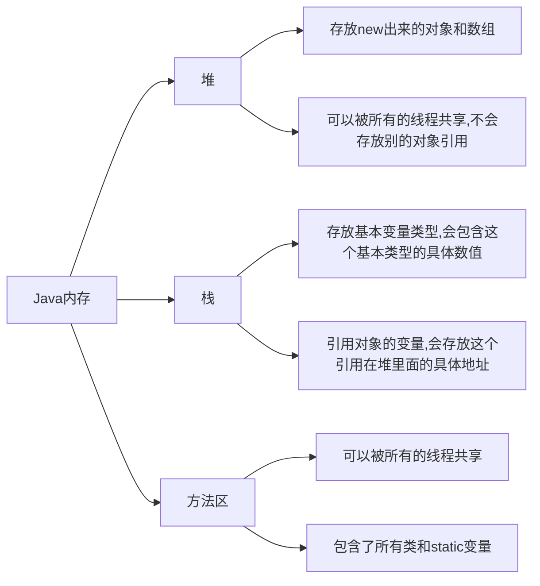

# Java注解和反射

## 什么是注解

- Annotation是从JDK5.0开始引入的新技术.
- Annotation的作用
  - 不是程序本身,可以对程序作出解释,这点类似于注释(comment)
  - <mark>可以被其它程序(如:编译器)读取</mark>
- Annotation的格式
  - 注解以"@注释名"在代码中存在,还可以添加一些参数值,如:@SuppressWarnings(value="unlocked")
- Annotation在哪里使用
  - 可以附加在package,class,method,field等上面,相当于给他们添加了额外的辅助信息,我们可以<mark>通过反射机制编程实现对这些元数据的访问</mark>

## 内置注解

+ @Override:定义在 java.lang.Override中,此注释只适用于修饰方法,表示一个方法声明打算重写超类中的另一个方法声明.
+ @Desprecated 
+ @SuppressWarning

```java
package com.monki.javaAnnotation;

import java.util.ArrayList;
import java.util.List;

//什么是注解
@SuppressWarnings("all")
public class test01 {
    //@override重写的注解
    @Override
    public String toString() {
        return super.toString();
    }

    //
    @Deprecated
    //不推荐程序员使用,但是可以使用,或存在更好的方法
    public static void test(){

    }
    //Suppressing 镇压警告
    @SuppressWarnings("all")
    public void test02(){
        List list = new ArrayList();
    }
    public static void main(String[] args) {
        test();
    }
}

```

## 元注解

+ 元注解的作用是<mark>负责注解其它注解</mark>,Java定义了四个标准的meta-annotation类型,被他们用来提供对其它annotation类型作说明.
+ 这些注解和它们所支持的类在java.lang.annotation包中可以找到.
  - **@Target** : 用于描述注解的使用范围
  - **@Retention** : 表示需要在什么级别保存改注释信息,用于描述注解的生命周期
    - (SOURCE<CLASS<**RUNTIME(主要用这个)**)
  - **@Document** : 说明该注解将被包含在Javadoc中
  - **@Inheritated** : 说明子类可以继承父类中的该注解 

```java
package com.monki.javaAnnotation;

import java.lang.annotation.*;

//测试元注解
@MyAnnotation
public class MetaAnnotationTest {

    @MyAnnotation
    public void test(){

    }
}
//定义一个注解
//Target 表示注解用在哪些地方
@Target(value ={ElementType.METHOD,ElementType.TYPE} )
//Retention表示我们的注解在什么地方还有效
//RUNTIME>CLASS>SOURCE
@Retention(value = RetentionPolicy.RUNTIME)
//表示是否将我们的注解生成在JavaDoc中
@Documented
//Inherited 子类可以继承父类的注解
@Inherited
@interface MyAnnotation{

}
```

## 自定义注解

- 使用@interface 自定义注解时,自动继承了java.lang.annotation.Annotation接口
- 分析：
  - @interface用来声明一个注解，格式：public@interface 注解名{定义内容}
    - 其中的每一个方法实际上是声明了一个配置参数.
    - 方法的名称就是参数的名称
    - 返回值类型就是参数的类型（返回值只能是基本类型，Class，String，enum).
    - 可以通过default来声明参数的默认值
    -  如果只有一个参数成员，一般参数名为value
    - 注解元素必须要有值，我们定义注解元素时，经常使用空字符串，0作为默认值.

```java

package com.monki.javaAnnotation;

import java.lang.annotation.ElementType;
import java.lang.annotation.Retention;
import java.lang.annotation.RetentionPolicy;
import java.lang.annotation.Target;

//自定义注解

public class UserDefinedAnnotation {

    //注解可以显式赋值,如果没有默认值,我们就必须给注解赋值
    
    
    @MyAnnotation2(age=18,schools = {"清华","浙大"})
    public void test(){
        
    }

    @MyAnnotation3("")
    public void test2() {
        
    }
}
@Target({ElementType.TYPE,ElementType.METHOD})
@Retention(RetentionPolicy.RUNTIME)
@interface MyAnnotation2
{
    //注解的参数: 参数类型 + 参数名();
    String name() default "梦奇";
    int age();
    int id() default -1;//如果默认值为-1,代表不存在
    String[] schools() default {"安徽理工大学"};
}
@interface MyAnnotation3{
    String value();
}
```

## 反射概述

### 静态语言VS动态语言

**动态语言**:在运行时可以改变其结构的语言,例如Object-C,C#,JavaScript,PHP,Python等

**静态语言**:与动态语言对应的,运行时结构不可变的语言就是静态语言。如Java,C,C++

**Java不是动态语言，但Java可以称之“准动态语言”。即Java有一定的动态性，我们可以利用反射机制获得类似动态语言的特性。Java的动态性让编程的时候更加灵活！（同时也增加了不安全性）**

### Java Reflaction

- Reflaction（反射)是Java被视为动态语言的关键，反射机制允许程序在执行期借助于Reflaction API取得任何类的内部信息，并能直接操作任意对象的内部属性即方法。
- 加载完类之后，在堆内存的方法区中就产生了一个Class类型的对象（一个类只有一个Class对象），这个对象就包含了完整的类的结构信息。**这个Class对象就像一面镜子,透过这个镜子看到类的结构，所以我们形象地称之为反射。**

## 获得反射对象

### Java反射机制提供的功能

- 在运行时判断任意一个对象所属的类
- 在运行时构造任意一个类的对象
- 在运行时判断任意一个类所具有的成员变量和方法
- 在运行时获取泛型信息
- 在运行时调用任意一个对象的成员变量和方法
- 在运行时处理注解
- 生成动态代理(学习**AOP（Aspect-oriented programming）面向切面编程**时候用到)
- ........

### Java反射的优点和缺点

- **优点**：可以实现动态创建对象和编译，体现出很大的灵活性
- **缺点**：对性能有影响。使用反射基本上是一种解释操作，我们可以直接告诉JVM，我们希望做什么并且它满足我们的要求。这类操作总是慢于直接执行相同的操作。

> “Plain Old Java Object”“简单java对象”。POJO的内在含义是指那些没有从任何类继承、也没有实现任何接口，更没有被其它框架侵入的java对象。

```java
package com.monki.javaReflaction;

//什么叫反射
public class KnowReflaction {
    public static void main(String[] args) throws ClassNotFoundException {
        //通过反射获取类的Class对象
        Class c1 = Class.forName("com.monki.javaReflaction.User");
        System.out.println(c1);

        Class c2 = Class.forName("com.monki.javaReflaction.User");
        Class c3 = Class.forName("com.monki.javaReflaction.User");
        Class c4 = Class.forName("com.monki.javaReflaction.User");
        
        //一个类在内存中只有一个class对象
        //一个类被加载后，类的整个结构都会被封装在Class对象中
        System.out.println(c2.hashCode());
        System.out.println(c3.hashCode());
        System.out.println(c4.hashCode());
    }
}

//实体类pojo entity
class User{
    private String name;
    private int id;
    private int age;
    public User(){


    }

    public User(String name, int id, int age) {
        this.name = name;
        this.id = id;
        this.age = age;
    }

    public String getName() {
        return name;
    }

    public void setName(String name) {
        this.name = name;
    }

    public int getId() {
        return id;
    }

    public void setId(int id) {
        this.id = id;
    }

    public int getAge() {
        return age;
    }

    public void setAge(int age) {
        this.age = age;
    }

    @Override
    public String toString() {
        return "User{" +
                "name='" + name + '\'' +
                ", id=" + id +
                ", age=" + age +
                '}';
    }
}
```

## 得到Class类的几种方式

### Class类

对象照镜子后可以得到的信息：某个类的属性、方法和构造器、某个类到底实现了哪些接口。

对于每个类而言，JRE都为其保留一个不变的Class类型的对象。一个Class对象包含了特定某个结构（**class/interface/enum/annotation/primitive type(基本数据类型)/void/[]**)的有关信息。

- Class**本身也是一个类**
- Class对象只能由系统建立
- 一个加载的类在JVM中只会有一个Class实例
- 一个Class对象对应的是一个加载到JVM的一个.class文件
- 每个类的实例都会记得自己是由哪个Class实例所生成
- 通过Class可以完整的得到一个类中所有被加载的结构
- **Class类是Reflaction的根源**，针对任何你想动态加载、运行的类，唯有先获得相应的Class对象

### 获取Class类的实例

1. 若已知具体的类，通过类的class属性获取，该方法最为安全可靠，程序性能最高

   ```java
   Class clazz=Person.class;
   ```

2. 已知某个类的实例，调用该实例的getClass()方法获取

   ```java
   Person person = new Person();
   Class clazz = person.getClass();
   ```

3. 已知一个类的全类名，可通过Class类的静态方法forName()获取，可能抛出ClassNotFoundException

   ```java
   Class clazz = Class.forname("包名.类名");
   ```

4. 内置基本数据类型可以直接使用类名.TYPE

5. 还可以利用后面提到的ClassLoader

```java
package com.monki.javaReflaction;

//测试class类的创建方式有哪些
public class ClassCreateTest {
    public static void main(String[] args) throws ClassNotFoundException {
        Person person = new Student();
        System.out.println("这个人是"+person.name);
        //方式一：通过对象获得
        Class c1 = person.getClass();
        System.out.println(c1.hashCode());
        //方式二：forname获得
        Class c2 = Class.forName("com.monki.javaReflaction.Student");
        System.out.println(c2.hashCode());
        //方式三：通过类名.class获得
        Class c3 = Student.class;
        System.out.println(c3.hashCode());
        //方式四：基本数据类型的包装类通过.TYPE获得
        Class c4 = Integer.TYPE;
        System.out.println(c4);

        //获得父类类型
        Class c5 = c1.getSuperclass();
        System.out.println(c5);


    }


}
class Person{
    String name;
    public Person(){

    }
    public Person(String name){
        this.name = name;
    }

    @Override
    public String toString() {
        return "Person{" +
                "name='" + name + '\'' +
                '}';
    }
}

class Student extends Person{
    public Student(){
        super("学生");
    }
}

class Teacher extends Person{
    public Teacher(){
        super("老师");
    }

}
```

## 所有类型的Class对象

**class/interface/enum/annotation/primitive type(基本数据类型)/void/[]**

```java
package com.monki.javaReflaction;

import java.lang.annotation.ElementType;

//所有类型的class
public class AllClassTypeTest {
    public static void main(String[] args) {
        Class<Object> c1 = Object.class;//类
        Class<Comparable> c2 = Comparable.class;//接口
        Class<String[]> c3 = String[].class;//一维数组
        Class<int[][]> c4 = int[][].class;//二维数组
        Class<Override> c5 = Override.class;//注解
        Class<ElementType> c6 = ElementType.class;//枚举
        Class<Integer> c7 = Integer.class;//基本数据类型
        Class<Void> c8 = void.class;//void
        Class<Class> c9 = Class.class;//Class
        System.out.println(c1);
        System.out.println(c2);
        System.out.println(c3);
        System.out.println(c4);
        System.out.println(c5);
        System.out.println(c6);
        System.out.println(c7);
        System.out.println(c8);
        System.out.println(c9);

        //只要元素类型与维度一样，就是同一个Class
        int[] a = new int[10];
        int[] b = new int[100];
        System.out.println(a.getClass().hashCode());
        System.out.println(b.getClass().hashCode());

    }

}
------------------------------------------------------------------
class java.lang.Object
interface java.lang.Comparable
class [Ljava.lang.String;
class [[I
interface java.lang.Override
class java.lang.annotation.ElementType
class java.lang.Integer
class java.lang.Void
class java.lang.Class
```

## 类加载内存分析



### 类的加载过程

当程序主动使用某个类时，**如果该类还未被加载到内存中**，则系统会通过以下三个步骤对该类进行初始化。


- **加载**：将class文件字节码内容加载到内存中，并将这些静态数据转换成方法区运行时的数据结构，然后生成一个代表这个类的java.lang.class对象。
- **链接**：将Java类的二进制代码合并到JVM的运行状态中的过程
  - 验证：确保加载的类信息符合JVM规范，并没有安全方面的问题
  - 准备：正式为**类变量（static)**分配内存**并设置类变量默认初始值**的阶段，这些内存都将在方法区中分配
  - 解析：虚拟机常量池内的符号引用（常量名）替换成直接引用（地址）的过程
- **初始化**
  - 执行类构造器<clinit>(方法)。类构造器<clinit>(）方法是由编译时期自动收集类中所有**类变量的赋值动作和静态代码块中的语句合并产生**的。（类构造器是构造类信息的，不是构造该类信息的构造器）。
  - 当一个初始化类的时候，如果发现其父类还没有进行初始化，则需要先触发其父类的初始化。
  - 虚拟机会保证一个类的<clinit>（）方法在多线程环境中被正确加锁和同步

```java
package com.monki.javaReflaction;

//类如何加载
public class HowClassLoaded {
    public static void main(String[] args) {
        A a = new A();
        System.out.println(A.m);
        /*
        * 1.加载到内存，会产生一个类对应的Class对象
        * 2.链接，链接结束后 m = 0
        * 3.初始化
        *  <clinit>(){
        *       System.out.println("A类静态代码块初始化");
        *       m = 300;
        *       m = 100;
        *   }
        * */
    }
}

class A{
    static{
        System.out.println("A类静态代码块初始化");
        m = 300;
    }
    /*
    * m = 300
    * m = 100
    * */
    static int m = 100;
    public A(){
        System.out.println("A类的无参构造初始化");
    }
}
```


## 分析类的初始化

### 什么时候类会初始化？

- 类的**主动引用**（**一定会发生类的初始化**）
  - 虚拟机启动，先初始化main所在的类
  - new一个类的对象
  - 调用类的静态成员（除了final常量）和静态方法
  - 使用java.lang.reflact包的方法对类进行反射调用
  - 当初始化一个类，如果其父类没有被初始化，则会先初始化其父类
- 类的**被动引用**（**不会发生类的初始化**）
  - 当访问一个静态域时，只有真正声明这个域的类才会被初始化。如：通过子类引用父类的静态变量，不会导致子类初始化
  - 通过数组定义类引用，不会触发此类的初始化
  - 通过常量不会触发此类的初始化（常量**在链接阶段**就存入调用类的常量池中了）

```java
package com.monki.javaReflaction;

//测试类什么时候被初始化
public class WhenClassInitialed {
    static {
        System.out.println("main所在类被初始化");
    }
    public static void main(String[] args) throws ClassNotFoundException {
        //1.主动引用
        //new类的对象
        //Son son = new Son();

        /*
        main所在类被初始化
          父类被初始化
          子类被初始化
          */

        //反射也会产生主动引用
        //Class.forName("com.monki.javaReflaction.Son");

        /*
        main所在类被初始化
          父类被初始化
          子类被初始化
          */

        //调用类的成员变量
        //System.out.println(Son.m);

        /*
        main所在类被初始化
        父类被初始化
        子类被初始化
        100
        */
        System.out.println("----------------------------------------------------------------");
        //2.类的被动引用
        //通过子类引用父类的成员变量,子类不会被初始化,但会被加载
        //System.out.println(Son.b);

        /*
        main所在类被初始化
        父类被初始化
        2
        */

        //通过数组定义类引用,只是声明了一片空间
        //Son[] array = new Son[5];
        /*main所在类被初始化*/
        //调用常量,在链接阶段存入常量池
        System.out.println(Son.M);
        /*
        main所在类被初始化
        1
        */
    }

}

class Father{
    static int b = 2;
    static {
        System.out.println("父类被初始化");
    }
}
class Son extends Father{
    static {
        System.out.println("子类初始化");
        m = 300;
    }
    static int m = 100;
    static final int M = 1;
}
```

**对于调用常量,在链接阶段存入常量池的疑惑，ChatGpt这样解释，似乎和狂神说的有出入**

>在Java中，编译时常量（Compile-time Constants）和运行时常量（Runtime Constants）是两种不同类型的常量，它们在初始化和处理方式上有所不同。
>
>1. **编译时常量（Compile-time Constants）：**
>   - 编译时常量是在编译阶段就可以确定其值的常量。这意味着它们的值在编译代码时就已经固定，无需在运行时计算。
>   - 编译时常量通常包括以下几种类型：
>     - 基本数据类型的常量：如整数、浮点数、字符等。
>     - 字符串常量：如 `"Hello, World!"`。
>     - 枚举常量：枚举类型的常量值。
>     - final修饰的常量字段：在编译时就被初始化的`final`字段。
>   - 这些常量会在编译时被直接嵌入到代码中，不需要在运行时加载或计算。
>2. **运行时常量（Runtime Constants）：**
>   - 运行时常量是在运行时才能确定其值的常量。它们的值在编译代码时无法确定，需要在程序运行时才能计算出来。
>   - 运行时常量的处理可能需要涉及类加载、初始化以及其他运行时阶段。
>   - 一些可能被视为运行时常量的例子包括：
>     - 非`final`修饰的字段：虽然可以在编译时初始化，但是如果不满足编译时常量的条件，那么它们在运行时被视为运行时常量。
>     - 表达式的结果：如果表达式的值在编译时无法确定，它可能会在运行时被视为运行时常量。
>     - 通过反射获取的字段或方法的值。
>
>需要注意的是，编译时常量和运行时常量的区分主要是用于理解和说明常量的性质。Java编译器在一些情况下可能会进行常量折叠（Constant Folding），将一些表达式在编译阶段计算成编译时常量。然而，一般来说，编译时常量是在编译阶段就已经固定的，而运行时常量的值需要在程序运行时计算。
>
>在 Java 中，类的常量在编译阶段就被解析并存入相应的类的常量池中。因此，在你的示例代码中，`Son.M` 是一个编译时常量，会在 `Son` 类的常量池中被存储。调用类 `WhenClassInitialed` 不会在自己的常量池中存储 `Son.M`。
>
>实际上，当你运行 `System.out.println(Son.M);` 时，JVM 会加载 `Son` 类，但 `Son.M` 的值已经在编译阶段被存储在 `Son` 类的常量池中。因此，JVM 不需要将 `Son.M` 存入调用类 `WhenClassInitialed` 的常量池。它只需要通过符号引用找到 `Son.M` 的值并打印出来，而不会触发 `Son` 类的初始化。
>
>对于这个特定的情况，`Son.M` 是编译时常量，不需要在调用类的常量池中存储，而是在运行时直接使用.

## 类加载器的作用

- 类加载器的作用：将class文件字节码内容加载到内存中，并将这些静态数据转换成方法区的运行时数据结构，然后在堆中生成一个代表这个类的java.lang.Class对象，作为方法区中类数据的访问入口。
- 类缓存：标准的JavaSE类加载器可以按照要求查找类，但一旦某个类被加载到类加载器中，它将维护加载（缓存）一段时间。不过JVM垃圾回收机制（gc）可以回收这些Class对象


```java
package com.monki.javaReflaction;

public class GetClassLoaderTest {
    public static void main(String[] args) throws ClassNotFoundException {
        //获取系统类的加载器
        ClassLoader systemClassLoader = ClassLoader.getSystemClassLoader();
        System.out.println(systemClassLoader);//sun.misc.Launcher$AppClassLoader@18b4aac2

        //获取系统类加载器的父类加载器-->扩展类加载器
        ClassLoader parent = systemClassLoader.getParent();
        System.out.println(parent);//sun.misc.Launcher$ExtClassLoader@74a14482

        //获取扩展类加载器的父类加载器-->根加载器(C/C++写的)
        ClassLoader parent1 = parent.getParent();
        System.out.println(parent1);//null

        //测试当前类是哪个加载器加载的
        ClassLoader classLoader = Class.forName("com.monki.javaReflaction.GetClassLoaderTest").getClassLoader();
        System.out.println(classLoader);//sun.misc.Launcher$AppClassLoader@18b4aac2-->系统类加载器

        //测试jdk内置的类是谁加载的
        classLoader = Class.forName("java.lang.Object").getClassLoader();
        System.out.println(classLoader);//null-->根加载器

        //如何获得系统类加载器可以加载的路径

        System.out.printf(System.getProperty("java.class.path"));
        
        //双亲委派机制，保证安全性，保证核心类不被破坏
            //自定义java.lang.String-->看用户类加载器有没有这个包-->看扩展类加载器有没有这个包-->根加载器有没有这个包-->如果有这个类，你自己写的就没用了
        
        /*
D:\Applications\java\jdk1.8.0_381\jre\lib\charsets.jar;
D:\Applications\java\jdk1.8.0_381\jre\lib\deploy.jar;
D:\Applications\java\jdk1.8.0_381\jre\lib\ext\access-bridge-64.jar;
D:\Applications\java\jdk1.8.0_381\jre\lib\ext\cldrdata.jar;
D:\Applications\java\jdk1.8.0_381\jre\lib\ext\dnsns.jar;
D:\Applications\java\jdk1.8.0_381\jre\lib\ext\jaccess.jar;
D:\Applications\java\jdk1.8.0_381\jre\lib\ext\jfxrt.jar;
D:\Applications\java\jdk1.8.0_381\jre\lib\ext\localedata.jar;
D:\Applications\java\jdk1.8.0_381\jre\lib\ext\nashorn.jar;
D:\Applications\java\jdk1.8.0_381\jre\lib\ext\sunec.jar;
D:\Applications\java\jdk1.8.0_381\jre\lib\ext\sunjce_provider.jar;
D:\Applications\java\jdk1.8.0_381\jre\lib\ext\sunmscapi.jar;
D:\Applications\java\jdk1.8.0_381\jre\lib\ext\sunpkcs11.jar;
D:\Applications\java\jdk1.8.0_381\jre\lib\ext\zipfs.jar;
D:\Applications\java\jdk1.8.0_381\jre\lib\javaws.jar;
D:\Applications\java\jdk1.8.0_381\jre\lib\jce.jar;
D:\Applications\java\jdk1.8.0_381\jre\lib\jfr.jar;
D:\Applications\java\jdk1.8.0_381\jre\lib\jfxswt.jar;
D:\Applications\java\jdk1.8.0_381\jre\lib\jsse.jar;
D:\Applications\java\jdk1.8.0_381\jre\lib\management-agent.jar;
D:\Applications\java\jdk1.8.0_381\jre\lib\plugin.jar;
D:\Applications\java\jdk1.8.0_381\jre\lib\resources.jar;
D:\Applications\java\jdk1.8.0_381\jre\lib\rt.jar;
D:\STUDY\IdeaProjects\Summer-2023\out\production\Summer-2023;
D:\STUDY\IdeaProjects\Summer-2023\src\com\lib\commons-io-2.13.0.jar;
D:\Applications\IDEA\IntelliJ IDEA 2023.1.4\lib\idea_rt.jar
        * */

    }
}
```

## 创建运行时类的对象

### 获取运行时类的完整结构

通过反射获取运行时类的完整结构

Field、Method、Constructor、SuperClass、Interface、Annotation

声明为**getXxxs（）**的方法能获得**本类，父接口，父类的所有public xxx;**

声明为**getDeclearedXxxs（）的方法**,只能获得**本类声明的所有类型的xxx**public, protected, default (package) access,
and private ，**excludes inherited xxx**;

被获取Class类对象的类

```java
//实体类pojo entity
class User{
    private String name;
    private int id;
    private int age;
    private User(String name){
        this.name= name;
    }
    public User(){


    }

    public User(String name, int id, int age) {
        this.name = name;
        this.id = id;
        this.age = age;
    }

    private void test(){};
    public String getName() {
        return name;
    }

    public void setName(String name) {
        this.name = name;
    }

    public int getId() {
        return id;
    }

    public void setId(int id) {
        this.id = id;
    }

    public int getAge() {
        return age;
    }

    public void setAge(int age) {
        this.age = age;
    }

    @Override
    public String toString() {
        return "User{" +
                "name='" + name + '\'' +
                ", id=" + id +
                ", age=" + age +
                '}';
    }
}
```

使用如下类获取上述类的信息

```java
package com.monki.javaReflaction;

import java.lang.reflect.Constructor;
import java.lang.reflect.Field;
import java.lang.reflect.Method;

public class GetClassInfoTest {
    public static void main(String[] args) throws ClassNotFoundException, NoSuchFieldException, NoSuchMethodException {
        Class c1 = Class.forName("com.monki.javaReflaction.User");

        //获得类的名字
        System.out.println(c1.getName()); //包名+类名
        System.out.println(c1.getSimpleName()); //获得类名

        //获得类的属性
        System.out.println("-----------------------------------------------------------");
        Field[] fields = c1.getFields();//获取不到因为没有公有属性,返回一个0长度的数组
        // returns public fields of the class or interface represented by this Class object.
        for (Field field : fields) {
            System.out.println(field);

        }
        fields = c1.getDeclaredFields();
        /*Returns an array of Field objects reflecting all the fields declared by the class
            or interface represented by this Class object. This includes public, protected, default (package) access,
            and private fields, but excludes inherited fields.
            */
        for (Field field : fields) {
            System.out.println(field);
        }
        //获得指定属性的值
        //Field name = c1.getField("name");//先找本类，找不到再找父接口，找不到再找父类，最后找不到抛出异常
        /*Exception in thread "main" java.lang.NoSuchFieldException: name
	        at java.lang.Class.getField(Class.java:1703)
	        at com.monki.javaReflaction.GetClassInfoTest.main(GetClassInfoTest.java:30)
        */
        //System.out.println(name);
        Field name = c1.getDeclaredField("name");
        System.out.println(name);

        //获得类的方法
        System.out.println("------------------------------------------------------");
        Method[] methods = c1.getMethods();
        for (Method method : methods) {
            System.out.println("公共的："+method);
        }
        methods = c1.getDeclaredMethods();
        for (Method method : methods) {
            System.out.println("所有声明的："+method);
        }

        //获得指定方法
        //需要参数是因为java的重载，需要获取参数判断需要的是哪个方法
        Method getName = c1.getMethod("getName", null);
        Method setName = c1.getMethod("setName", String.class);
        System.out.println(getName);
        System.out.println(setName);

        //获得类的构造器
        System.out.println("------------------------------------------------------");
        Constructor[] constructors = c1.getConstructors();
        for (Constructor constructor : constructors) {
            System.out.println(constructor);
        }
        constructors = c1.getDeclaredConstructors();
        for (Constructor constructor : constructors) {
            System.out.println("#"+constructor);
        }
        //获得指定的构造器
        Constructor declaredConstructor = c1.getDeclaredConstructor(String.class);
        System.out.println(declaredConstructor);
    }
}
```

## 动态创建对象执行方法

**创建类的对象：**

- ** 调用对象的newInstance（）方法**

  - 类必须要有一个无参构造器

  - 类的构造器访问权限要足够

- **通过构造器的newInstance(参数...)创建**
  - 先通过getDeclaredConstructor(Class...参数类型)取得本类的指定形参类型的构造器

  - 调用构造器对象的newInstance(参数...)方法


**调用指定的方法：**

1. 获取这个方法所在类的对象
1. 通过Class类对象的getMethod(String name,Class...参数类型)方法获得Method对象
1. 使用Method类自带的invoke(Object obj,Object[] args)进行调用，第一个参数传递这个方法所在类的对象

**Object invoke(Object obj,Object[] args)**

- Object对应原方法的返回值，若原方法无返回值，此时返回为null
- 若原方法为静态方法 ，形参Object obj可为null
- 若原方法参数列表为空，则Object[] args为null
- 若原方法声明为private,则调用invoke方法前，需显式调用Method对象的**setAccessible(true)方法**，将可以访问private方法

**setAccessible**

- Method和Field、Constructor对象都有setAccessible方法
- setAccessible作用是启动和禁用访问安全检查的开关
- 参数值为true则指示反射的对象在使用时应该取消Java语言访问检查
  - **提高反射的效率。如果代码中必须使用反射，而该代码需要频繁地被调用，那么请设置为true.**
  - **使得原本无法访问的私有成员也可以被访问**
- 参数值为false则指示反射的对象应该实施Java语言访问检查（默认）

**修改指定的属性：**

1. 获取这个属性所在类的对象
2. 通过getDeclaredField(属性变量名)方法获取Field对象
3. 调用Field对象的setAccessible(true)方法提权
4. 调用Field对象的set(Object obj,要设置属性的值)修改属性值

```java
package com.monki.javaReflaction;

import java.lang.reflect.Constructor;
import java.lang.reflect.Field;
import java.lang.reflect.InvocationTargetException;
import java.lang.reflect.Method;

//动态的创建对象，通过反射
public class CreateObjectThroughReflaction {
    public static void main(String[] args) throws ClassNotFoundException, InstantiationException, IllegalAccessException, NoSuchMethodException, InvocationTargetException, NoSuchFieldException {
        //获得Class对象
        Class c1 = Class.forName("com.monki.javaReflaction.User");
        //构造一个对象
        //User user = (User)c1.newInstance();//本质上是调用了无参构造
        //System.out.println(user);

        //通过构造器创建对象
        Constructor constructor = c1.getDeclaredConstructor(String.class, int.class, int.class);
        User monki = (User)constructor.newInstance("Monki", 1, 18);
        System.out.println(monki);

        //通过反射调用方法
        User user2 = (User)c1.newInstance();
        //通过反射获取方法
        Method setName = c1.getDeclaredMethod("setName", String.class);
        //invoke:激活
        //(方法所处对象，方法的参数值)
        setName.invoke(user2,"沈");
        System.out.println(user2.getName());
        //通过反射操作属性
        User user4 = (User)c1.newInstance();
        Field name = c1.getDeclaredField("name");
        //不能直接操作私有属性或方法，我们需要关闭程序的安全检测，使用属性或方法的setAccessible(true)设置
        name.setAccessible(true);//
        name.set(user4,"梦奇");
        System.out.println(user4.getName());
    }
}
```

## 分析反射造成的性能问题

```java
package com.monki.javaReflaction;

import java.lang.reflect.InvocationTargetException;
import java.lang.reflect.Method;

//分析性能问题
public class PerformanceAnalyze {
    //普通方法调用
    public static void test01(){
        User user = new User();
        long startTime = System.currentTimeMillis();

        for (int i = 0; i < 1000000000; i++) {
            user.getName();
        }
        long endTime = System.currentTimeMillis();
        System.out.println("普通方式执行十亿次:"+(endTime-startTime)+"ms");
    }
    //反射方式调用
    public static void test02() throws NoSuchMethodException, InvocationTargetException, IllegalAccessException {
        User user = new User();
        Class c1 = user.getClass();
        Method getName = c1.getMethod("getName", null);
        long startTime = System.currentTimeMillis();

        for (int i = 0; i < 1000000000; i++) {
           getName.invoke(user,null);
        }
        long endTime = System.currentTimeMillis();
        System.out.println("反射方式执行十亿次:"+(endTime-startTime)+"ms");
    }
    //反射方式调用,并关闭安全检查
    public static void test03() throws NoSuchMethodException, InvocationTargetException, IllegalAccessException {
        User user = new User();
        Class c1 = user.getClass();
        Method getName = c1.getMethod("getName", null);
        getName.setAccessible(true);
        long startTime = System.currentTimeMillis();

        for (int i = 0; i < 1000000000; i++) {
            getName.invoke(user,null);
        }
        long endTime = System.currentTimeMillis();
        System.out.println("反射方式执行十亿次（关闭检测）:"+(endTime-startTime)+"ms");
    }

    public static void main(String[] args) throws InvocationTargetException, NoSuchMethodException, IllegalAccessException {
        test01();
        test02();
        test03();
    }
}
--------------------------------------------------------------------------------------------------------
普通方式执行十亿次:3ms
反射方式执行十亿次:1466ms
反射方式执行十亿次（关闭检测）:873ms
```

