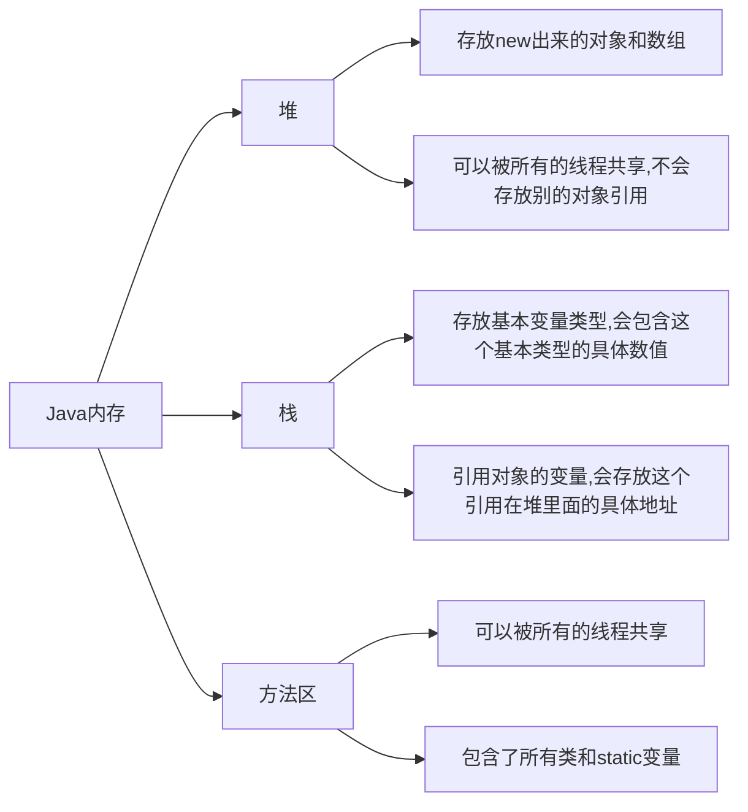

# Java注解和反射

## 什么是注解

- Annotation是从JDK5.0开始引入的新技术.
- Annotation的作用
  - 不是程序本身,可以对程序作出解释,这点类似于注释(comment)
  - <mark>可以被其它程序(如:编译器)读取</mark>
- Annotation的格式
  - 注解以"@注释名"在代码中存在,还可以添加一些参数值,如:@SuppressWarnings(value="unlocked")
- Annotation在哪里使用
  - 可以附加在package,class,method,field等上面,相当于给他们添加了额外的辅助信息,我们可以<mark>通过反射机制编程实现对这些元数据的访问</mark>

## 内置注解

+ @Override:定义在 java.lang.Override中,此注释只适用于修饰方法,表示一个方法声明打算重写超类中的另一个方法声明.
+ @Desprecated 
+ @SuppressWarning

```java
package com.monki.javaAnnotation;

import java.util.ArrayList;
import java.util.List;

//什么是注解
@SuppressWarnings("all")
public class test01 {
    //@override重写的注解
    @Override
    public String toString() {
        return super.toString();
    }

    //
    @Deprecated
    //不推荐程序员使用,但是可以使用,或存在更好的方法
    public static void test(){

    }
    //Suppressing 镇压警告
    @SuppressWarnings("all")
    public void test02(){
        List list = new ArrayList();
    }
    public static void main(String[] args) {
        test();
    }
}

```

## 元注解

+ 元注解的作用是<mark>负责注解其它注解</mark>,Java定义了四个标准的meta-annotation类型,被他们用来提供对其它annotation类型作说明.
+ 这些注解和它们所支持的类在java.lang.annotation包中可以找到.
  - **@Target** : 用于描述注解的使用范围
  - **@Retention** : 表示需要在什么级别保存改注释信息,用于描述注解的生命周期
    - (SOURCE<CLASS<**RUNTIME(主要用这个)**)
  - **@Document** : 说明该注解将被包含在Javadoc中
  - **@Inheritated** : 说明子类可以继承父类中的该注解 

```java
package com.monki.javaAnnotation;

import java.lang.annotation.*;

//测试元注解
@MyAnnotation
public class MetaAnnotationTest {

    @MyAnnotation
    public void test(){

    }
}
//定义一个注解
//Target 表示注解用在哪些地方
@Target(value ={ElementType.METHOD,ElementType.TYPE} )
//Retention表示我们的注解在什么地方还有效
//RUNTIME>CLASS>SOURCE
@Retention(value = RetentionPolicy.RUNTIME)
//表示是否将我们的注解生成在JavaDoc中
@Documented
//Inherited 子类可以继承父类的注解
@Inherited
@interface MyAnnotation{

}
```

## 自定义注解

- 使用@interface 自定义注解时,自动继承了java.lang.annotation.Annotation接口
- 分析：
  - @interface用来声明一个注解，格式：public@interface 注解名{定义内容}
    - 其中的每一个方法实际上是声明了一个配置参数.
    - 方法的名称就是参数的名称
    - 返回值类型就是参数的类型（返回值只能是基本类型，Class，String，enum).
    - 可以通过default来声明参数的默认值
    -  如果只有一个参数成员，一般参数名为value
    - 注解元素必须要有值，我们定义注解元素时，经常使用空字符串，0作为默认值.

```java

package com.monki.javaAnnotation;

import java.lang.annotation.ElementType;
import java.lang.annotation.Retention;
import java.lang.annotation.RetentionPolicy;
import java.lang.annotation.Target;

//自定义注解

public class UserDefinedAnnotation {

    //注解可以显式赋值,如果没有默认值,我们就必须给注解赋值
    
    
    @MyAnnotation2(age=18,schools = {"清华","浙大"})
    public void test(){
        
    }

    @MyAnnotation3("")
    public void test2() {
        
    }
}
@Target({ElementType.TYPE,ElementType.METHOD})
@Retention(RetentionPolicy.RUNTIME)
@interface MyAnnotation2
{
    //注解的参数: 参数类型 + 参数名();
    String name() default "梦奇";
    int age();
    int id() default -1;//如果默认值为-1,代表不存在
    String[] schools() default {"安徽理工大学"};
}
@interface MyAnnotation3{
    String value();
}
```

## 反射概述

### 静态语言VS动态语言

**动态语言**:在运行时可以改变其结构的语言,例如Object-C,C#,JavaScript,PHP,Python等

**静态语言**:与动态语言对应的,运行时结构不可变的语言就是静态语言。如Java,C,C++

**Java不是动态语言，但Java可以称之“准动态语言”。即Java有一定的动态性，我们可以利用反射机制获得类似动态语言的特性。Java的动态性让编程的时候更加灵活！（同时也增加了不安全性）**

### Java Reflaction

- Reflaction（反射)是Java被视为动态语言的关键，反射机制允许程序在执行期借助于Reflaction API取得任何类的内部信息，并能直接操作任意对象的内部属性即方法。
- 加载完类之后，在堆内存的方法区中就产生了一个Class类型的对象（一个类只有一个Class对象），这个对象就包含了完整的类的结构信息。**这个Class对象就像一面镜子,透过这个镜子看到类的结构，所以我们形象地称之为反射。**

## 获得反射对象

### Java反射机制提供的功能

- 在运行时判断任意一个对象所属的类
- 在运行时构造任意一个类的对象
- 在运行时判断任意一个类所具有的成员变量和方法
- 在运行时获取泛型信息
- 在运行时调用任意一个对象的成员变量和方法
- 在运行时处理注解
- 生成动态代理(学习**AOP（Aspect-oriented programming）面向切面编程**时候用到)
- ........

### Java反射的优点和缺点

- **优点**：可以实现动态创建对象和编译，体现出很大的灵活性
- **缺点**：对性能有影响。使用反射基本上是一种解释操作，我们可以直接告诉JVM，我们希望做什么并且它满足我们的要求。这类操作总是慢于直接执行相同的操作。

> “Plain Old Java Object”“简单java对象”。POJO的内在含义是指那些没有从任何类继承、也没有实现任何接口，更没有被其它框架侵入的java对象。

```java
package com.monki.javaReflaction;

//什么叫反射
public class KnowReflaction {
    public static void main(String[] args) throws ClassNotFoundException {
        //通过反射获取类的Class对象
        Class c1 = Class.forName("com.monki.javaReflaction.User");
        System.out.println(c1);

        Class c2 = Class.forName("com.monki.javaReflaction.User");
        Class c3 = Class.forName("com.monki.javaReflaction.User");
        Class c4 = Class.forName("com.monki.javaReflaction.User");
        
        //一个类在内存中只有一个class对象
        //一个类被加载后，类的整个结构都会被封装在Class对象中
        System.out.println(c2.hashCode());
        System.out.println(c3.hashCode());
        System.out.println(c4.hashCode());
    }
}

//实体类pojo entity
class User{
    private String name;
    private int id;
    private int age;
    public User(){


    }

    public User(String name, int id, int age) {
        this.name = name;
        this.id = id;
        this.age = age;
    }

    public String getName() {
        return name;
    }

    public void setName(String name) {
        this.name = name;
    }

    public int getId() {
        return id;
    }

    public void setId(int id) {
        this.id = id;
    }

    public int getAge() {
        return age;
    }

    public void setAge(int age) {
        this.age = age;
    }

    @Override
    public String toString() {
        return "User{" +
                "name='" + name + '\'' +
                ", id=" + id +
                ", age=" + age +
                '}';
    }
}
```

## 得到Class类的几种方式

### Class类

对象照镜子后可以得到的信息：某个类的属性、方法和构造器、某个类到底实现了哪些接口。

对于每个类而言，JRE都为其保留一个不变的Class类型的对象。一个Class对象包含了特定某个结构（**class/interface/enum/annotation/primitive type(基本数据类型)/void/[]**)的有关信息。

- Class**本身也是一个类**
- Class对象只能由系统建立
- 一个加载的类在JVM中只会有一个Class实例
- 一个Class对象对应的是一个加载到JVM的一个.class文件
- 每个类的实例都会记得自己是由哪个Class实例所生成
- 通过Class可以完整的得到一个类中所有被加载的结构
- **Class类是Reflaction的根源**，针对任何你想动态加载、运行的类，唯有先获得相应的Class对象

### 获取Class类的实例

1. 若已知具体的类，通过类的class属性获取，该方法最为安全可靠，程序性能最高

   ```java
   Class clazz=Person.class;
   ```

2. 已知某个类的实例，调用该实例的getClass()方法获取

   ```java
   Person person = new Person();
   Class clazz = person.getClass();
   ```

3. 已知一个类的全类名，可通过Class类的静态方法forName()获取，可能抛出ClassNotFoundException

   ```java
   Class clazz = Class.forname("包名.类名");
   ```

4. 内置基本数据类型可以直接使用类名.TYPE

5. 还可以利用后面提到的ClassLoader

```java
package com.monki.javaReflaction;

//测试class类的创建方式有哪些
public class ClassCreateTest {
    public static void main(String[] args) throws ClassNotFoundException {
        Person person = new Student();
        System.out.println("这个人是"+person.name);
        //方式一：通过对象获得
        Class c1 = person.getClass();
        System.out.println(c1.hashCode());
        //方式二：forname获得
        Class c2 = Class.forName("com.monki.javaReflaction.Student");
        System.out.println(c2.hashCode());
        //方式三：通过类名.class获得
        Class c3 = Student.class;
        System.out.println(c3.hashCode());
        //方式四：基本数据类型的包装类通过.TYPE获得
        Class c4 = Integer.TYPE;
        System.out.println(c4);

        //获得父类类型
        Class c5 = c1.getSuperclass();
        System.out.println(c5);


    }


}
class Person{
    String name;
    public Person(){

    }
    public Person(String name){
        this.name = name;
    }

    @Override
    public String toString() {
        return "Person{" +
                "name='" + name + '\'' +
                '}';
    }
}

class Student extends Person{
    public Student(){
        super("学生");
    }
}

class Teacher extends Person{
    public Teacher(){
        super("老师");
    }

}
```

## 所有类型的Class对象

**class/interface/enum/annotation/primitive type(基本数据类型)/void/[]**

```java
package com.monki.javaReflaction;

import java.lang.annotation.ElementType;

//所有类型的class
public class AllClassTypeTest {
    public static void main(String[] args) {
        Class<Object> c1 = Object.class;//类
        Class<Comparable> c2 = Comparable.class;//接口
        Class<String[]> c3 = String[].class;//一维数组
        Class<int[][]> c4 = int[][].class;//二维数组
        Class<Override> c5 = Override.class;//注解
        Class<ElementType> c6 = ElementType.class;//枚举
        Class<Integer> c7 = Integer.class;//基本数据类型
        Class<Void> c8 = void.class;//void
        Class<Class> c9 = Class.class;//Class
        System.out.println(c1);
        System.out.println(c2);
        System.out.println(c3);
        System.out.println(c4);
        System.out.println(c5);
        System.out.println(c6);
        System.out.println(c7);
        System.out.println(c8);
        System.out.println(c9);

        //只要元素类型与维度一样，就是同一个Class
        int[] a = new int[10];
        int[] b = new int[100];
        System.out.println(a.getClass().hashCode());
        System.out.println(b.getClass().hashCode());

    }

}
------------------------------------------------------------------
class java.lang.Object
interface java.lang.Comparable
class [Ljava.lang.String;
class [[I
interface java.lang.Override
class java.lang.annotation.ElementType
class java.lang.Integer
class java.lang.Void
class java.lang.Class
```

## 类加载内存分析



### 类的加载过程
